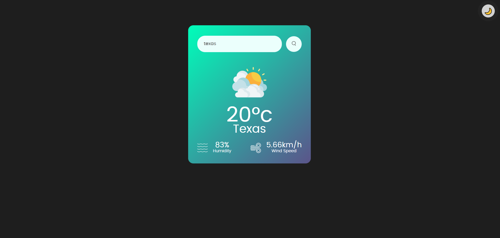

# ☀️ Weather App - Aplicativo do Clima



🔁 English version below

## 🌍 Description (English)

Simple, modern and responsive weather application built with **HTML, CSS and pure JavaScript**.

You can type any city name and the app will fetch real-time weather data using the **OpenWeatherMap API**. It displays temperature, humidity and wind speed in a clean and stylish interface.

### 🎯 Features
- 🌗 Dark/light mode toggle  
- 🔍 City search  
- 🌡️ Current temperature display  
- 💧 Humidity  
- 🍃 Wind speed  
- 📱 Responsive design  
- 🎨 Dynamic weather icons  

### 🧰 Technologies used
- HTML5  
- CSS3  
- Vanilla JavaScript  
- [OpenWeatherMap API](https://openweathermap.org/api)  

---

## 🌤️ Descrição (Português)

Aplicativo de clima simples, moderno e responsivo criado com **HTML, CSS e JavaScript puro**.

Você pode digitar o nome de qualquer cidade e o app irá buscar informações climáticas em tempo real utilizando a **API do OpenWeatherMap**. Ele exibe a temperatura, umidade e velocidade do vento de forma clara e estilizada.

### 🎯 Funcionalidades
- 🌗 Alternância entre modo escuro e claro  
- 🔍 Busca de cidades  
- 🌡️ Exibição de temperatura atual  
- 💧 Umidade do ar  
- 🍃 Velocidade do vento  
- 📱 Design responsivo para mobile e desktop  
- 🎨 Ícones dinâmicos de clima  

### 🧰 Tecnologias usadas
- HTML5  
- CSS3  
- JavaScript (Vanilla)  
- API [OpenWeatherMap](https://openweathermap.org/api)  

---

## 🚀 How to use

### 🇺🇸 English:

1. Clone the repository:
```bash
git clone https://github.com/GustavoHRdev/Weather-App.git

```
2. Open the index.html file in your browser.

3. Type the city name in the search field and press Enter.

4. Enjoy real-time weather information!

### BR Em Português: 

1. Clone o repositório:
```bash
git clone https://github.com/GustavoHRdev/Weather-App.git
```
2. Abra o arquivo index.html no seu navegador.

3. Digite o nome da cidade no campo de busca e pressione Enter.

4. Aproveite as informações do clima em tempo real!


---

## 📫 Contato / Contact

- 🌐 [LinkedIn](https://www.linkedin.com/in/gustavohrdev) – Conecte-se comigo no LinkedIn  
- 🐱 [GitHub](https://github.com/GustavoHRdev) – Veja meus projetos no GitHub  
- 📱 [WhatsApp](https://wa.me/5543996448129) – Para contato rápido


