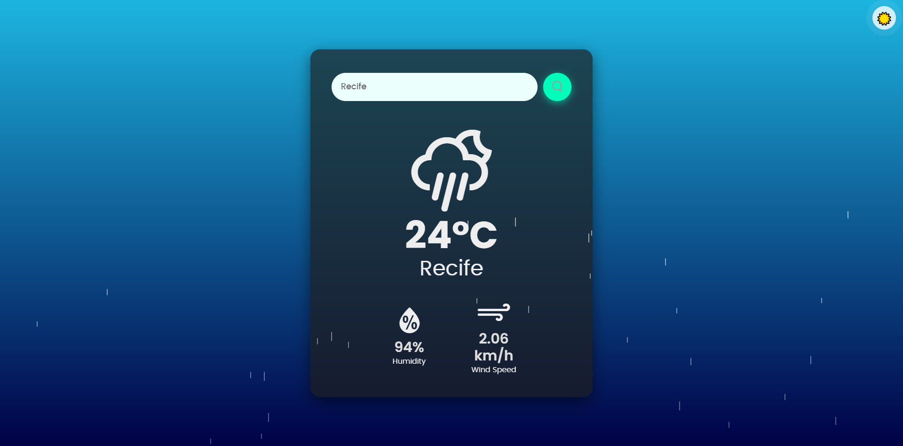

# ☀️ Weather App – Real-Time Forecast

🔗 Acesse o projeto online / Access the project online:  
👉 [https://gustavohrdev.github.io/Weather-App/](https://gustavohrdev.github.io/Weather-App/)

<p align="center">
  <a href="#pt-br">🇧🇷 Ver em Português</a> • <a href="#en">🇺🇸 See in English</a>
</p>

---

<p align="center">
  
</p>

---

## 🚀 How to use
=======
## <a name="en"></a>🇺🇸 English Version


### 🌍 Overview

**Weather App** is a modern, fully responsive web application that allows users to get real-time weather updates for any city in the world. Built with **Vanilla JavaScript**, **HTML5**, and **CSS3**, this project demonstrates my ability to build functional UIs, consume external APIs, and design user-centered interfaces.

> Ideal for recruiters, HR professionals, and developers looking for clean code, UI/UX polish, and practical use of asynchronous data.

---

### 🧩 Key Features
- 🌗 **Dark / Light Mode** toggle with smooth transitions  
- 🔍 **City Search** with error handling  
- 🌡️ **Current Temperature**, humidity & wind speed  
- 📱 **Mobile-first** responsive design  
- 🎨 **Dynamic Icons & Gradients** based on weather and time  
- ⚙️ **Modular code structure** with semantic HTML

---

### 🔧 Tech Stack
- **HTML5**, **CSS3**, **JavaScript (ES6+)**  
- **OpenWeatherMap API**  
- **Custom animations** (rain, snow, sun)  
- **Fully client-side (no frameworks)**

---

### 🧠 What I Learned
- Efficient API integration and async/await handling  
- Responsive design techniques (flexbox, media queries)  
- UX decisions based on user behavior  
- Graceful fallback for invalid search input  
- Clean code organization and accessibility improvements  

---

### 🚀 Try It Locally
```bash
git clone https://github.com/GustavoHRdev/Weather-App.git
```
1. Open the index.html file in your browser.

2. Type the city name in the search field and press Enter.

3. Enjoy real-time weather updates!

---

### 📫 Contact Me
- 🌐 [LinkedIn](https://www.linkedin.com/in/gustavohrdev)  
- 🐱 [GitHub](https://github.com/GustavoHRdev)  
- 📱 [WhatsApp](https://wa.me/5543996448129)

---

# ☀️ Weather App – Previsão do Tempo em Tempo Real

<p align="center">
  <a href="#pt-br">🇧🇷 Versão em Português</a> • <a href="#en">🇺🇸 See in English</a>
</p>

---

## <a name="pt-br"></a>🇧🇷 Versão em Português

### 🌤️ Visão Geral

**Weather App** é uma aplicação web moderna e responsiva que exibe a previsão do tempo em tempo real para qualquer cidade do mundo. Desenvolvido com **JavaScript puro**, **HTML5** e **CSS3**, este projeto evidencia minha capacidade de integrar APIs externas, estruturar código limpo e entregar uma interface bonita e funcional.

> Ideal para recrutadores, profissionais de RH e desenvolvedores que buscam projetos com atenção ao detalhe e boa experiência do usuário.

---

### 🧩 Funcionalidades
- 🌗 Alternância entre **modo escuro e claro** com animações suaves  
- 🔍 Busca por cidades com tratamento de erros  
- 🌡️ Temperatura atual, umidade e velocidade do vento  
- 📱 Design **100% responsivo**, com foco em mobile  
- 🎨 Ícones e gradientes dinâmicos conforme clima e horário  
- ⚙️ Código modular e semântico

---

### 🛠️ Tecnologias Utilizadas
- HTML5  
- CSS3  
- JavaScript (ES6+)  
- API [OpenWeatherMap](https://openweathermap.org/api)  
- Animações customizadas (chuva, neve, sol)  
- Design client-side (sem frameworks)

---

### 🧠 O Que Aprendi
- Consumo eficiente de APIs com `async/await`  
- Técnicas de design responsivo com **flexbox** e **media queries**  
- Foco em **usabilidade** e experiência do usuário  
- Tratamento de erros e feedbacks visuais  
- Organização de código com boas práticas  

---

### 🚀 Como Testar Localmente
```bash
git clone https://github.com/GustavoHRdev/Weather-App.git
```
1. Abra o arquivo index.html no seu navegador.

2. Digite o nome da cidade no campo de busca e pressione Enter.

3. Aproveite as informações do clima em tempo real!

---

### 📫 Entre em Contato
- 🌐 [LinkedIn](https://www.linkedin.com/in/gustavohrdev)  
- 🐱 [GitHub](https://github.com/GustavoHRdev)  
- 📱 [WhatsApp](https://wa.me/5543996448129)